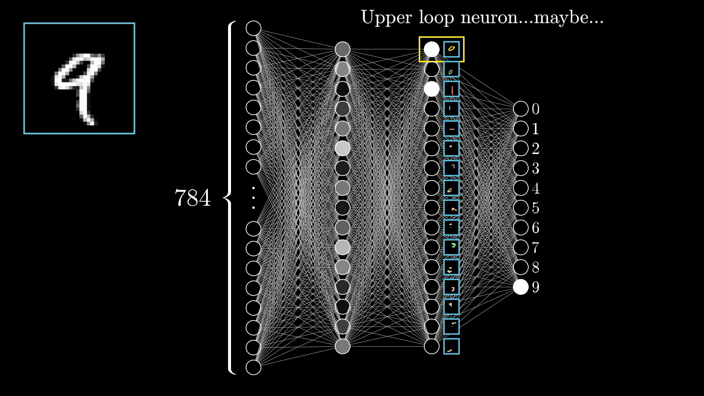
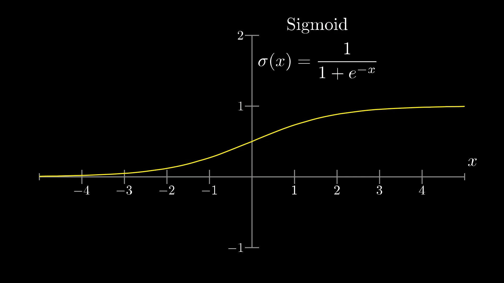

# INFO7375_NeuralNetworks_AI

## Table of Contents

- [Chapter 1: Human Brain and Neural Networks](#chapter-1-human-brain-and-neural-networks)
  - [Python Environment](#python-environment)
  - [Human Brain and Biological Neurons](#human-brain-and-biological-neurons)
  - [Neural Networks Basics](#neural-networks-basics)
  - [Gradient Descent and How Neural Networks Learn](#gradient-descent-and-how-neural-networks-learn)
  - [McCulloch and Pitts Neuron Model](#mcculloch-and-pitts-neuron-model)
  - [Essential Python Libraries for Data Science and Machine Learning](#essentia-python-libraries-for-data-science-and-machine-learning)
  Essential Python Libraries for Data Science and Machine Learning

- [Chapter 2: The Perceptron](#chapter-2-the-perceptron)
  - [Introduction to the Perceptron](#introduction-to-the-perceptron)
  - [History of the Perceptron](#history-of-the-perceptron)

- [Chapter 3: Supervised Training and Logistic Regression](#chapter-3-supervised-training-and-logistic-regression)
  - [Perceptron for Logistic Regression](#perceptron-for-logistic-regression)
  - [Neural Networks for Logistic Regression and Classification](#neural-networks-for-logistic-regression-and-classification)
  - [Linear Binary Classifier](#linear-binary-classifier)
  - [Loss (Cost) Function](#loss-cost-function)

- [Chapter 4: Advanced Topics in Logistic Regression](#chapter-4-advanced-topics-in-logistic-regression)
  - [Perceptron for Logistic Regression with Sigmoid Activation Function](#perceptron-for-logistic-regression-with-sigmoid-activation-function)
  - [Vectors and Matrices](#vectors-and-matrices)
  - [Perceptron for Logistic Regression with Many Training Samples](#perceptron-for-logistic-regression-with-many-training-samples)
  - [Gradient Descent Optimization](#gradient-descent-optimization)
  - [Logistic Regression](#logistic-regression)
  - [Neural Networks for Logistic Regression](#neural-networks-for-logistic-regression)

## Chapter 1: Human Brain and Neural Networks

### Python Environment
Create a virtual environment:
```
python -m venv env_name
```

Activate the virtual environment:
```
source env_name/bin/activate
```

Install required packages (if any):
```
pip install <package_name>
```

### Human Brain and Biological Neurons

1. **Neuron**: The basic unit of the nervous system, responsible for processing and transmitting information.
2. **Dendrite**: Receives signals toward the cell body, many per neuron, short and branched, not myelinated, tree-like structure.
3. **Neuron Cell Body**: The signal travels toward the neuron's cell body (soma), where it is processed.
4. **Axon**: Transmits signals away from the cell body, usually one per neuron, can be long, often myelinated, smooth structure.
5. **Synapse**: The junction between two neurons where information is transmitted from one neuron to another.
6. **Neuromorphic**: Referring to the design and development of hardware and software systems inspired by the structure and function of the human brain.
7. **Synaptic Plasticity**: The ability of synapses to strengthen or weaken over time, in response to increases or decreases in their activity.

### Neural Networks Basics
#### Neurons
Neurons: a thing that holds a number between 0.0 and 1.0.<br>
Digit images have 28 × 28 = 784 pixels, so we create a the first layer with 784 neurons.<br>


The output layer of our network has 10 neurons, corresponds 1 - 10.<br>


#### Neural Network Architecture
In a perfect world, A loop can be broken down into several small edges.<br>

<br>


#### Weighted Sum Formula
Weighted Sum = w1*a1 + w2*a2 + w3*a4 + ... + wn*an<br>
- a (activation) refers to the pixel values from the image. These values, typically between 0 and 1 (e.g., grayscale intensity)<br>
- w (weight) represents how important each pixel(neuron) from the image is for a neuron in the next layer.<br>

Since there are 784 neurons in the first layer, each neuron in the second layer has 784 weights.<br>

<p align="left">
  
  
</p>

#### Neural Network Structure: Neurons, Weights, and Biases
| Layer            | Number of Neurons | Weights per Neuron | Total Weights | Bias per Neuron | Total Biases |
|------------------|-------------------|--------------------|---------------|-----------------|--------------|
| Input Layer      | 50                | 0                  | 0             | 0               | 0            |
| Second Layer     | 100               | 50                 | 5000          | 1               | 100          |
| Third Layer      | 64                | 100                | 6400          | 1               | 64           |
| Output Layer     | 10                | 64                 | 640           | 1               | 10           |

#### ReLU (Rectified Linear Unit)
The **ReLU** activation function outputs the input directly if it is positive; otherwise, it returns 0. This function is widely used in hidden layers for its efficiency.

The formula for the ReLU function is:

`ReLU(x) = max(0, x)`

#### Sigmoid Function
The **sigmoid** activation function maps input values to a range between 0 and 1, which is useful for binary classification tasks.

The formula for the sigmoid function is:

`σ(x) = 1 / (1 + exp(-x))`



#### Vanishing Gradient Problem
For an input that results in large positive or negative values, the sigmoid function will output values near 0 or 1, and the derivative (gradient) will be close to 0. When this gradient is backpropagated through many layers, it shrinks even further.<br>

#### Bias in Neural Networks
**Bias** allows the model to shift the activation of neurons, ensuring the relationship between inputs (x) and outputs (y) doesn't have to pass through the origin (when x = 0, y = 0).

#### Softmax Function

To convert the output values of the neurons in the output layer into probabilities, we apply the **softmax** function. The softmax function is:

`P(y_i) = e^(z_i) / Σ(e^(z_j))`

Where:
- `z_i` is the raw output (weighted sum + bias) of the neuron.
- The softmax function converts the raw outputs into probabilities, ensure that all output values are positive.
- The result is a set of probabilities that sum to 1, and the neuron with the highest probability is considered the predicted class.

### Gradient Descent and How Neural Networks Learn
#### Cost
The **cost function** (also called the loss function) measures the error between the predicted output of the neural network and the actual target values. It helps determine how well the model is performing. Common cost functions include:<br>

- **Mean Squared Error (MSE)**: Typically used for regression tasks.
- **Cross-Entropy Loss**: Commonly used for classification tasks.

The goal during training is to minimize the cost by adjusting the weights and biases, thereby improving the model’s accuracy.<br>

Initialized with totally random weights and biases, the network is terrible at identifying digits.<br>

<p align="left">
  
  
</p>

#### Gradient Descent
**Gradient Descent** minimizes the cost function by updating weights and biases. The update rule is:

`θ = θ - α * ∂J(θ) / ∂θ`

Where:
- `θ` represents the weights/biases,
- `α` is the learning rate,
- `J(θ)` is the cost function.
- `∂J(θ) / ∂θ` is slope of the cost function `J(θ)`(`C(w)`) at the current value of `θ`(`w`)

By following the slope (moving in the downhill direction), we approach a local minimum.<br>
<p align="left">
  
  
</p>

#### Multivariable (2-Variable) Gradient Descent

Imagine a function with two inputs and one output, we get a space with xy-plane.<br>

<p align="left">
  
  
</p>

In multivariable gradient descent with two variables, the update rules are:

`x_1 = x_1 - α * ∂J(x_1, x_2) / ∂x_1`

`x_2 = x_2 - α * ∂J(x_1, x_2) / ∂x_2`

Where:
- `α` is the learning rate,
- `∂J(x_1, x_2) / ∂x_1` and `∂J(x_1, x_2) / ∂x_2` are the partial derivatives of the cost function with respect to `x_1` and `x_2`.
- `C(w)` represents the **cost function**.
- `∇C(w)` is the **gradient of the cost function** with respect to the weights and biases (`w`).

`C(w)` and `J(w)` are commonly used to denote the cost function in different contexts:
- `C(w)` is often used as shorthand for the **cost function**, representing the model's error or loss.
- `J(w)` is also used to denote the **cost function**, particularly in optimization problems.

This process is repeated iteratively until convergence.

#### Example of Partial Derivatives

Given a function:

`f(x, y) = x^2 + 3xy + y^2`

The partial derivative of `f` with respect to `x` is:

`∂f/∂x = 2x + 3y`

The partial derivative of `f` with respect to `y` is:

`∂f/∂y = 3x + 2y`

These derivatives represent how the function changes with respect to `x` and `y` individually while keeping the other variable constant.


### McCulloch and Pitts Neuron Model

#### Logic Gates using McCulloch-Pitts Neuron Model
The **AND gate** outputs 1 only when both inputs are 1.

| x1  | x2  | AND Output (y) |
| --- | --- | -------------- |
| 0   | 0   | 0              |
| 0   | 1   | 0              |
| 1   | 0   | 0              |
| 1   | 1   | 1              |

The **OR gate** outputs 1 if at least one input is 1.

| x1  | x2  | OR Output (y)  |
| --- | --- | -------------- |
| 0   | 0   | 0              |
| 0   | 1   | 1              |
| 1   | 0   | 1              |
| 1   | 1   | 1              |

The **NOT gate** inverts the input. If the input is 0, the output is 1. If the input is 1, the output is 0.

| z   | NOT Output (y) |
| --- | -------------- |
| 0   | 1              |
| 1   | 0              |

The **NOR gate** outputs 1 only when both inputs are 0 (inversion of OR gate).

| x1  | x2  | NOR Output (y) |
| --- | --- | -------------- |
| 0   | 0   | 1              |
| 0   | 1   | 0              |
| 1   | 0   | 0              |
| 1   | 1   | 0              |

The **XOR gate** outputs 1 only when the inputs are different (i.e., one input is 1 and the other is 0).

| x1  | x2  | XOR Output (y) |
| --- | --- | ---------------|
| 0   | 0   | 0              |
| 0   | 1   | 1              |
| 1   | 0   | 1              |
| 1   | 1   | 0              |

XOR Gate Construction:
XOR can be constructed using **AND**, **OR**, and **NOT** gates:<br>
`XOR(x1, x2) = (x1 OR x2) AND NOT(x1 AND x2)`

### Essential Python Libraries for Data Science and Machine Learning

1. **Pandas**:
   - **Key functionality**: Data manipulation and analysis.
   - **Most important feature**: `DataFrame` allows for easy handling of structured data, such as tables and spreadsheets.

2. **scikit-learn**:
   - **Key functionality**: Machine learning algorithms.
   - **Most important feature**: `Model selection and training` with algorithms like classification, regression, and clustering.

3. **NumPy**:
   - **Key functionality**: Numerical computing.
   - **Most important feature**: `ndarray` provides n-dimensional arrays and supports fast mathematical operations like matrix multiplication.

## Chapter 3: Supervised Training and Logistic Regression

#### Forward Propagation

1. **Input**: Pass the input data `x` into the network.
2. **Weighted Sum**: Calculate the weighted sum `z = w * x + b` for each neuron.
3. **Activation Function**: Apply an activation function `f(z)` to get the output `y`.
4. **Repeat**: Perform this process for each layer until reaching the output layer.
5. **Final Output**: The final output is the model’s prediction.

#### Backpropagation

1. **Error Calculation**: Compute the loss between the predicted output and the actual target.
2. **Gradient Calculation**: Compute the gradient of the loss with respect to weights using the chain rule.
3. **Update Weights**: Adjust weights using gradient descent: 
   `w = w - α * ∂J/∂w`
4. **Repeat**: Continue updating weights and biases across all layers to minimize the loss.